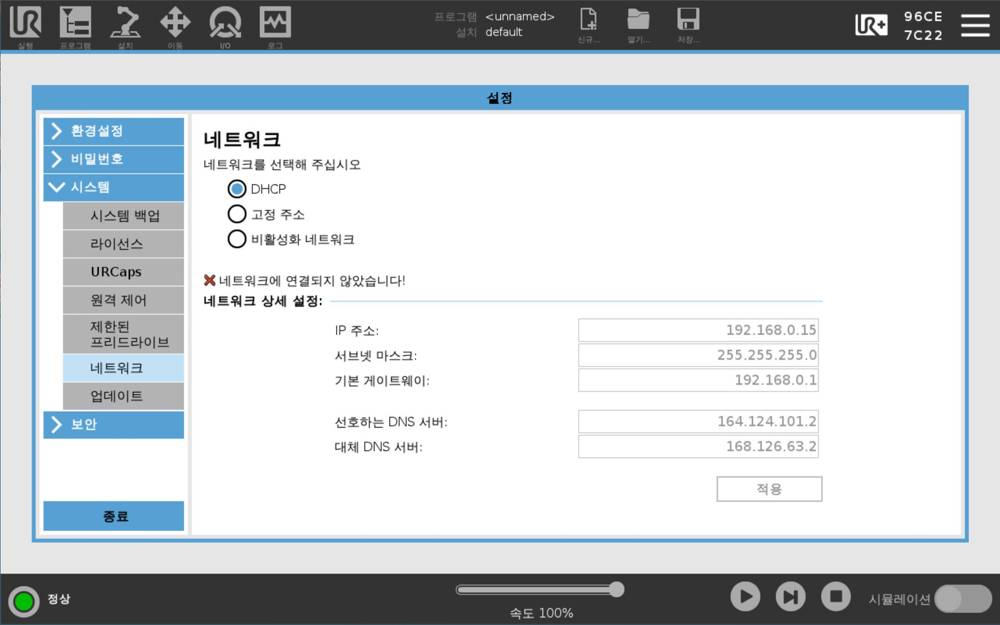
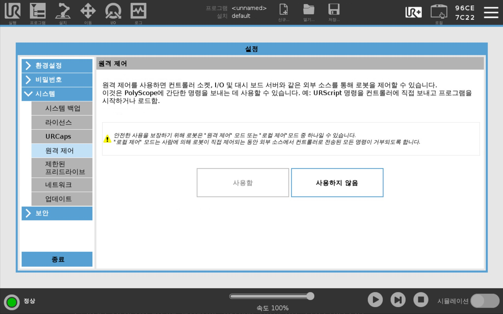
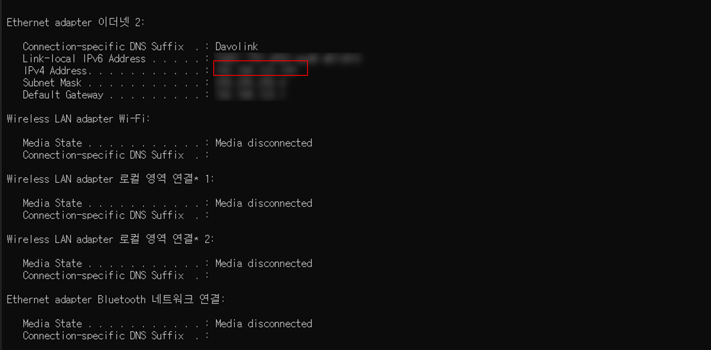
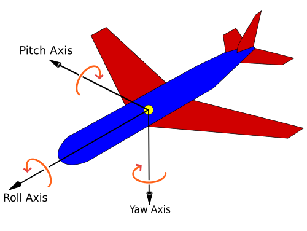

# Lecture 3: 컴퓨터를 이용한 로봇 원격 제어
본 강의에서는 로봇의 현재 상태를 모니터링하고, 실시간으로 제어하는 기술을 익힙니다. 각 단계별로 데이터를 어떻게 수집하고, 이를 기반으로 로봇의 동작을 어떻게 제어할 수 있는지 구체적으로 살펴봅니다.

## 목차
- [Lecture 3: 컴퓨터를 이용한 로봇 원격 제어](#lecture-3-컴퓨터를-이용한-로봇-원격-제어)
  - [목차](#목차)
  - [0. 실습 팁](#0-실습-팁)
  - [1. 로봇과 노트북의 IP 주소 확인 방법](#1-로봇과-노트북의-ip-주소-확인-방법)
    - [1.1 로봇의 IP 주소 확인 및 원격제어 설정](#11-로봇의-ip-주소-확인-및-원격제어-설정)
  - [1.2 노트북의 IP 주소 확인 방법](#12-노트북의-ip-주소-확인-방법)
  - [2. 기본적인 통신 방법 익히기](#2-기본적인-통신-방법-익히기)
    - [2.1 파이썬 파일 실행하기](#21-파이썬-파일-실행하기)
    - [2.2 스크립트](#22-스크립트)
  - [3. 스크립트 파일 전송하기](#3-스크립트-파일-전송하기)
    - [3.1 함수로 스크립트 파일 보내기](#31-함수로-스크립트-파일-보내기)
    - [3.2 동적으로 파일 불러오기](#32-동적으로-파일-불러오기)
    - [3.3 소켓 연결, 스크립트 인코딩, 전송](#33-소켓-연결-스크립트-인코딩-전송)
    - [3.4 실제 사용 예시](#34-실제-사용-예시)
  - [4. 로봇의 소켓 열기](#4-로봇의-소켓-열기)
    - [4.1 노트북에서 파이썬으로 서버 열기](#41-노트북에서-파이썬으로-서버-열기)
    - [4.2 로봇 소켓 스크립트](#42-로봇-소켓-스크립트)
  - [5. Pose와 Joint Parameter](#5-pose와-joint-parameter)
    - [5.1 Pose](#51-pose)
    - [5.2 Joint Parameter](#52-joint-parameter)
  - [6. 로봇의 현재 위치 정보 받아오기 - Pose](#6-로봇의-현재-위치-정보-받아오기---pose)
    - [6.1 로봇의 pose를 보내는 스크립트](#61-로봇의-pose를-보내는-스크립트)
    - [6.2 로봇의 pose를 받아오는 파이썬](#62-로봇의-pose를-받아오는-파이썬)
  - [7. 로봇의 현재 위치 정보 받아오기 - Joint Param](#7-로봇의-현재-위치-정보-받아오기---joint-param)
    - [7.1 로봇의 joint parameter를 보내는 스크립트](#71-로봇의-joint-parameter를-보내는-스크립트)
    - [7.2 로봇의 pose와 joint parameter를 받아오는 파이썬](#72-로봇의-pose와-joint-parameter를-받아오는-파이썬)
  - [8. 로봇의 pose값으로 움직여보기](#8-로봇의-pose값으로-움직여보기)
    - [8.1 현재 pose를 기준으로 하여 이동할 상대 pose를 전송하는 파이썬](#81-현재-pose를-기준으로-하여-이동할-상대-pose를-전송하는-파이썬)
    - [8.2 현재 pose를 기준으로 하여 이동할 상대 pose를 받아오는 스크립트](#82-현재-pose를-기준으로-하여-이동할-상대-pose를-받아오는-스크립트)
  - [9. 로봇의 joint parameter값 전송하기](#9-로봇의-joint-parameter값-전송하기)
  - [10. 마무리](#10-마무리)


## 0. 실습 팁
- **Python 실행 경로 설정**  
    Python 파일을 실행할 때는 다음과 같은 명령어를 터미널 창에 입력하여 반드시 해당 파일이 위치한 디렉토리로 이동해야 합니다.
  ```bash
  cd Day3/3_robot_remoting
  ```
    실행 경로를 변경하지 않으면, 상대 경로로 지정된 .script 파일을 찾지 못해 에러가 발생합니다.

- **IP 주소 확인**  
  실습 전, 로봇(robot_ip)과 노트북(server_ip)의 IP 주소가 정확히 설정되어 있는지 반드시 확인하시기 바랍니다.
  - `server_ip`: Python 코드가 실행되는 노트북의 IP
  - `robot_ip`: 제어 대상인 UR 로봇의 IP

- **프로그램 강제 종료 방법**  
  로봇에서 실행 중인 스크립트를 중단하거나 Python 프로그램을 강제로 종료해야 할 경우, 터미널에서 `Ctrl + C`를 입력하면 프로그램 실행이 중단됩니다.

- **payload 설정**  
  로봇의 Payload(부하 무게)를 올바르게 설정하지 않으면, 급격한 움직임이나 불안정한 동작으로 인해 안전사고가 발생할 수 있습니다. 실습 전에 장착된 장치의 무게를 확인하고, 해당 값을 로봇에 입력하시기 바랍니다.

위 부분은 앞으로 진행될 모든 실습에서 유용하게 쓰일 팁입니다. 오류 발생 시 위의 팁들을 가장 먼저 떠올려주시기 바랍니다.

## 1. 로봇과 노트북의 IP 주소 확인 방법
### 1.1 로봇의 IP 주소 확인 및 원격제어 설정
<div align="center">
  
</div>

우측상단 메뉴(햄버거) 버튼 클릭 후 `설정>시스템>네트워크` 탭에서 `DHCP`를 선택해주세요. 정상적인 경우, 잠시 기다리면 IP주소가 표시 됩니다. 위의 예시사진에서 IP 주소는 `192.168.0.15`입니다. 이 주소를 앞으로 `robot_ip`에 입력하면 됩니다.
<div align="center">
  
</div>

`시스템 - 원격제어` 탭에서 원격제어를 활성화합니다.

## 1.2 노트북의 IP 주소 확인 방법
<div align="center">
  
</div>

랜선을 연결한 뒤 노트북의 `cmd`창에서 `ipconfig` 명령어를 입력합니다. 이때 연결된 `Ethernet`의 `IPv4 Address를` 앞으로 `server_ip`에 입력하면 됩니다. 


## 2. 기본적인 통신 방법 익히기

### 2.1 파이썬 파일 실행하기
#### 예제코드(1_helloworld.py):
```python
# 2.1 파이썬 파일 실행하기
import socket

robot_ip = "192.168.1.6"  # 확인한 로봇의 IP 주소 입력

# 로봇에 보낼 URScript 코드 (팝업 메시지 표시 예제)
script = """
def helloworld():
    popup("Happy learning!")  # 로봇 teach pendant에 팝업 메시지 출력
end
"""

# 소켓 생성 (IPv4, TCP 프로토콜 사용)
socketPrimaryClient = socket.socket(socket.AF_INET, socket.SOCK_STREAM)

# 로봇의 Primary Interface(30001번 포트)에 연결
socketPrimaryClient.connect((robot_ip, 30001))  

# URScript 코드 전송 (문자열 끝에 개행 문자 \n 필요)
socketPrimaryClient.send((script + "\n").encode())

# 소켓 연결 종료
socketPrimaryClient.close()
```

위 코드를 보시면, 소켓의 타겟 ip에 `robot_url` 변수에 로봇의 IP를 바인딩 후 ```30001```번 소켓에 전송하는것을 볼 수 있습니다. ```30001```번 포트는 UR 내부에서 사용되는 포트 규약으로서, **Primary Interface**를 나타냅니다.

스크립트를 전송할 수 있는 ```30002```번 포트도 존재합니다. UR의 [문서](https://www.universal-robots.com/products/ur-developer-suite/archives/tutorials/urscript-socket-communication/)에 따르면 ```30001```번 포트는 고수준의 명령에 사용되고, ```30002```번 포트는 우선순위가 낮은 작업과 중요하지 않은 동작 제어에 사용된다고 명시되어있습니다.

### 2.2 스크립트 

```python
socketPrimaryClient.send((script + "\n").encode())
```
이 코드는 script 뒤에 **줄 바꿈을 나타내는 이스케이프 문자**인 ```\n```를 붙이고 byte 형식으로 인코딩해 로봇으로 전송합니다. script는 다음과 같은 내용을 담고있습니다.
```python
script = """
def helloworld():
    popup("Happy learning!")
end
"""
```
해당 스크립트의 내용은 `Happy learning!` 이라는 문자열을 다이얼로그를 통해 띄워주는 코드입니다. UR의 `로그`탭에서 출력되는 로그를 확인할 수 있습니다.


## 3. 스크립트 파일 전송하기
이번 실습에서는 스크립트를 변수에 직접 작성하는 방식이 아닌, 파일에 저장된채로 불러오는 방식에 대해 알아보겠습니다.

#### 예제코드(2_scriptfile.py):

### 3.1 함수로 스크립트 파일 보내기
``` python
def sendScriptFile(robot_ip, script_path, port=PORT_PRIMARY_CLIENT):
    script = getScriptFromPath(script_path)
    sendScript(robot_ip, script, port)
```
우선 `sendScriptFile()`함수는 robot_ip와, script_path, 그리고 전송할 포트를 매개변수로 받아옵니다. 그 후 `getScriptFromPath()` 함수를 통해 스크립트 파일 경로로부터 실제 파일 내용을 script 변수에 저장한 후, `sendScript()` 함수로 전송하는 코드입니다. 

### 3.2 동적으로 파일 불러오기
```python
def getScriptFromPath(script_path):
    with open(script_path, 'r', encoding='utf-8') as file:
        script = file.read()
    return script
```
`getScriptFromPath()`의 내용은 생각보다 간단합니다. `open()` 함수를 사용해 `script_path`로부터 불러옵니다. 이때 `'r'`은 읽기 전용으로 불러오겠다는 의미입니다. 만일 스크립트의 변경을 원하시면 `'w'`를, 새로운 내용을 추가하고 싶다면 `'a'`를 사용하시면 됩니다.

실무에 적용하기 위해서는 파일 경로가 잘못되었을 경우를 대비하여, `try-except`를 사용한 예외 처리를 통해 파일을 안전하게 불러올 수 있도록 해야 합니다.

### 3.3 소켓 연결, 스크립트 인코딩, 전송
```python
def sendScript(robot_ip, script, port=PORT_PRIMARY_CLIENT):
    socketClient = socket.socket(socket.AF_INET, socket.SOCK_STREAM)
    socketClient.connect((robot_ip, port))
    socketClient.send((script + "\n").encode())
    socketClient.close()
```
`sendScript()` 함수는 로봇과 TCP 소켓을 이용해 직접 연결한 뒤, 스크립트를 전송하는 역할을 합니다.
  
  1. **`socket.socket(socket.AF_INET, socket.SOCK_STREAM)`**   
   IPv4와 TCP 프로토콜을 사용하는 소켓 객체를 생성합니다.

  2. **`connect((robot_ip, port))`**  
   로봇의 IP 주소와 지정한 포트(기본값: `PORT_PRIMARY_CLIENT`)로 연결을 시도합니다.

  3. **`send((script + "\n").encode())`**  
   스크립트 문자열을 바이트 형태로 변환하여 전송합니다. 이때 `\n`(개행 문자)은 URScript 실행 시 필수로 포함되어야 합니다.

  4. **`close()`**  
   소켓 연결을 종료합니다.

### 3.4 실제 사용 예시

```python
if __name__ == "__main__":
    sendScriptFile(robot_ip, script_path, PORT_PRIMARY_CLIENT)
    # sendScriptFile(robot_ip, script_path, PORT_SECONDARY_CLIENT)
```

이 코드는 실제 파일 경로를 `script_path`에 바인딩한 후 앞서 확인한 `sendScriptFile()` 함수를 통해 로봇에 전달합니다. 만일 다른 파일을 전송하고 싶으시다면, `script_path`의 내용만 변경해주시면 됩니다. 이를 응용하여 버튼을 클릭하면 특정 스크립트를 로봇에 전송하는등의 자동화를 구성할 수 있습니다.


## 4. 로봇의 소켓 열기
### 4.1 노트북에서 파이썬으로 서버 열기
컴퓨터에서 로봇으로 스크립트 파일을 전송할 때는, UR로봇에 정의된 `30001` 또는 `30002` 포트를 통해 접속했습니다. 반대로 로봇에서 컴퓨터로 데이터를 전송하려면, 컴퓨터에서 특정 포트(이번 코드에서는 12345번)를 미리 열어두어야 합니다.  

그 후, 로봇의 `30001`번 포트를 사용하여 컴퓨터의 소켓에 접속하는 클라이언트 코드를 주입하면 됩니다. `3_hellosocket.py`의 `main` 함수에서는 비동기 방식으로 `socket`을 열고, 소켓이 열린 뒤 0.1초뒤에 스크립트 파일을 로봇으로 전송합니다.

#### 예제코드(3_hellosocket.py):
```python
async def handle_client(reader, writer):
    addr = writer.get_extra_info('peername')
    print(f"Connected by {addr}")
    
    try:
        while True:
            data = await reader.read(1024)      # 클라이언트로부터 데이터 수신
            if not data:
                break
            print(f"Received from {addr}: {data.decode()}")
            writer.write(data)                  # 받은 데이터를 그대로 되돌려줌
            await writer.drain()                # 전송 버퍼가 비워질 때까지 대기
    except asyncio.CancelledError:
        pass
    finally:
        print(f"Connection with {addr} closed")
        writer.close()                          # 연결 종료
```
- 클라이언트가 연결되면, 해당 소켓의 주소(`peername`)를 출력합니다.
- 무한 루프를 돌면서 데이터를 읽고, 읽은 내용을 그대로 다시 전송(`Echo`)합니다.
- 클라이언트 연결이 끊기면 루프를 종료하고 소켓을 닫습니다.

```python
async def main(host='0.0.0.0', port=12345):
    server = await asyncio.start_server(handle_client, host, port)
    addr = server.sockets[0].getsockname()
    print(f"Server listening on {addr}")
    print("Sending script to the robot...")

    await asyncio.sleep(0.1)                                 # 서버 안정화 대기
    sendScriptFile(robot_ip, script_path, PORT_PRIMARY_CLIENT) # 로봇에 스크립트 전송

    async with server:
        await server.serve_forever()                         # 서버 무기한 실행

```
- **`asyncio.start_server()`**  
  지정한 호스트와 포트에서 TCP 서버를 시작합니다.

- **서버 시작 후 스크립트 전송**  
  서버가 시작되면 잠시 대기(`sleep(0.1)`) 후, `sendScriptFile()` 함수를 호출하여 로봇에 URScript 파일을 전송합니다.

- **`serve_forever()`**  
  서버가 종료될 때까지 클라이언트 요청을 계속 처리합니다.  

### 4.2 로봇 소켓 스크립트
`3_hellosocket.py`에서 전송하는 script 파일은 다음과 같습니다.
#### 예제코드(hellosocket.script):
```python
def hellosocket():
    server_ip = "192.168.0.2"
    port=12345
    socket_open(server_ip,port,"socket_0")
    socket_send_line("hello socket from robot","socket_0")
    socket_close("socket_0")
end
```
UR 로봇에서는 ***urp*** 프로그래밍 언어를 사용합니다. 이 언어는 파이썬에서 소켓을 사용하는 방식과 매우 유사합니다.

- `server_ip` 노트북의 `ip`를 입력합니다.
- `socket_open()` 함수를 사용하여 소켓을 엽니다.
- `socket_send_line()` 함수를 통해 원하는 데이터를 소켓으로 전송합니다.
- `socket_close()` 함수를 사용하여 소켓을 닫습니다.

로봇의 현재 위치 값을 이러한 방식으로 얻어보겠습니다. 자세한 내용은 [References/scriptManual_SW5.16.pdf](https://github.com/nemojihoon/ai-robotics-education/blob/main/References/scriptManual_SW5.16.pdf)에서 확인할 수 있습니다.


## 5. Pose와 Joint Parameter
UR 로봇을 제어할 때, `pose`와 `joint` 파라미터는 서로 다른 방식으로 로봇의 위치와 자세를 정의합니다.

### 5.1 Pose
로봇의 TCP(Tool Center Point)의 위치와 방향을 나타내는 파라미터입니다. 이는 일반적으로 6개의 요소로 구성되며, 첫 세 가지는 X, Y, Z 좌표를 나타내고 나머지 세 가지는 롤(roll), 피치(pitch), 요(yaw) 각도를 나타냅니다. 아래 그림을 통해 롤, 피치, 요를 더 잘 이해할 수 있습니다. pose 파라미터를 사용하면 로봇의 TCP가 공간에서 특정 위치와 방향을 취하도록 설정할 수 있습니다. 이는 주로 작업의 끝점을 정의하거나 특정 궤적을 따라 이동할 때 사용됩니다.

<p align="center">
  
</p>  

<p align="center">
  출처: <a href="https://en.wikipedia.org/wiki/Aircraft_principal_axes">Wikipedia - Aircraft principal axes</a>
</p>

### 5.2 Joint Parameter 
로봇의 각 관절의 각도를 나타내는 파라미터입니다. UR 로봇은 일반적으로 6축 로봇이므로, Joint Parameter는 6개의 각도로 구성됩니다. 각 값은 각 관절의 회전 각도를 의미합니다. Joint Parameter를 사용하면 로봇의 각 관절을 개별적으로 제어할 수 있어, 특정 작업 공간 내에서 로봇의 자세를 세밀하게 조정할 수 있습니다. 이는 주로 로봇의 초기 설정이나 정밀한 동작이 필요할 때 사용됩니다.


## 6. 로봇의 현재 위치 정보 받아오기 - Pose

이번 실습에서는 로봇의 현재 정보를 보내는 방법에 대해 알아보겠습니다. 코드 전문은 `4_get_position1.py`와 `get_position1.script`에 존재합니다.

### 6.1 로봇의 pose를 보내는 스크립트
#### 예제코드(get_position1.script): 
```python
def get_position1():
    server_ip = "192.168.0.2"
    port = 12345
    socket_open(server_ip,port,"socket_0")

    socket_send_line("current_pos","socket_0")
    sleep(0.1)

    p_=get_actual_tcp_pose()

    i=0
    while (i<6):
        socket_send_int(p_[i]*10000)
        i=i+1
    end

    socket_close("socket_0")
end
```

해당 함수는 컴퓨터에서 열어둔 `12345`번 포트에 접속하여. 현재 pose값을 전송합니다. `get_actual_tcp_pose()` 함수는 현재 로봇의 pose 값, 즉 `X,Y,Z,RX,RY,RZ` 정보를 배열로 반환합니다. `get_actual_tcp_pose()`는 로봇의 pose를 m단위로 반환합니다. 따라서 통신 시 데이터를 깔끔하게 하기 위해 10,000배 하여 `socket_send_int()` 합니다. (URscript의 함수는 References/scriptManual_SW5.16.pdf에서 자세하게 확인할 수 있습니다.)

이때 코드를 보시면, `p[i]`를 한자리(digit)씩 보내는 것을 알 수 있습니다. 이렇게 한자리씩 보낸 배열값을 한번에 파싱하려면 어떻게 해야할까요?

### 6.2 로봇의 pose를 받아오는 파이썬
#### 예제코드(4_get_position1.py):
```python
async def handle_pos_data(reader):
    integers_data = []
    # Receive 24 bytes (6 integers = 6 * 4 bytes = 24 bytes) 
    data = await reader.readexactly(24)
    # Unpack the 6 short integers from the received data
    print("position data:", data)
    integers_data = struct.unpack('>iiiiii', data)
    actual_pos_data = [x/10000 for x in integers_data]

    return actual_pos_data
```
- `data = await reader.readexactly(24)`  
  이 코드는 소켓에 전송된 **payload**(의미 있는 실제 데이터 부분)값이 24바이트가 될 때까지 기다리는 함수입니다. `Int`는 4 bytes 이므로 즉, 총 6자리 배열을 받아오는 역할을 합니다. 
- `struct.unpack('>iiiiii', data)`   
  **`struct`** : 파이썬에서 바이너리 데이터(바이트열)를 지정한 형식으로 변환하는 모듈  
  **`>`** : Big-endian(네트워크 전송 표준) 바이트 순서를 사용  
  **`i`** : 4바이트 크기의 **signed int** 형식  
  24바이트의 바이너리 데이터를 **Big-endian** 방식의 6개 4바이트 정수(`int`)로 변환하여 튜플로 반환합니다.  
- `[x/10000 for x in integers_data]`  
  **get_position1.script** 에서 값을 전송할때 `float`(소수) 형식의 데이터에 10000을 곱해 보냈기 때문에 다시 10000을 나눠서 원래 값과 동일하게 만들어 줍니다.

## 7. 로봇의 현재 위치 정보 받아오기 - Joint Param
로봇의 현재 모습을 표현하는 방식에는 `X,Y,Z,RX,RY,RZ`를 표현하는 pose도 있지만, 각 6개의 관절값을 저장하고 있는 **joint parameter**도 존재합니다.

### 7.1 로봇의 joint parameter를 보내는 스크립트
#### 예제코드(get_position2.script): 
```python
    q_=get_actual_joint_positions()
    i=0
    while (i<6):
        socket_send_int(q_[i]*10000)
        i=i+1
    end
```
pose 값을 보냈을때와 사실 코드의 큰 차이는 존재하지 않습니다. 단지 함수가 `get_actual_tcp_pose`에서 `get_actual_joint_positions()`로 바뀌었을 뿐입니다. pose와 마찬가지로 **joint parameter**도 6자리 배열값이므로, 소켓을 받아오는 방식은 동일합니다. 

### 7.2 로봇의 pose와 joint parameter를 받아오는 파이썬
#### 예제코드(5_get_position2.py):
```python
async def handle_client(reader, writer):
    addr = writer.get_extra_info('peername')
    print(f"Connected by {addr}")
    
    try:
        while True:
            data = await reader.read(1024)
            if not data:
                break
            print(data)
            message = data.decode('utf-8').rstrip()  # Remove trailing newline
            print(f"Received from {addr}: {message}")

            if message == "current_pos":
                print("receive and handle current_pos message")
                p_ = await handle_pos_data(reader)
                print2(f"p_: {p_}", Color.GREEN)
                q_ = await handle_pos_data(reader)      # get joint parameter
                print2(f"q_: {q_}", Color.GREEN)

            writer.write(data)  # Echo back the received message
            await writer.drain()
    except asyncio.CancelledError:
        pass
    except ConnectionResetError:
        print(f"Connection with {addr} reset")
    finally:
        print(f"Connection with {addr} closed")
        writer.close()
        await writer.wait_closed()
```
이 `handle_client()` 함수는 기본적으로 `get_position1`과 유사하게 동작하지만,  
차이점은 `"current_pos"` 메시지를 처리할 때 **`p_`에 이어 `q_` 데이터를 추가로 수신**하는 부분이 포함되어 있다는 점입니다. 즉, 로봇의 현재 TCP pose(`p_`)뿐 아니라 추가적인 데이터(`q_`)를 연속으로 받아옵니다.  


## 8. 로봇의 pose값으로 움직여보기 
로봇의 현재 정보를 받아보았으니, 이번엔 반대로 로봇을 움직이는 스크립트를 전송해보겠습니다.

### 8.1 현재 pose를 기준으로 하여 이동할 상대 pose를 전송하는 파이썬
#### 예제코드(6_set_position1.py):
```python
async def handle_client(reader, writer):
    # 클라이언트 소켓 주소(IP, Port) 가져오기
    addr = writer.get_extra_info('peername')
    print(f"Connected by {addr}")
    
    try:
        while True:
            # 클라이언트로부터 최대 1024바이트 데이터 수신
            data = await reader.read(1024)
            if not data:  # 연결 종료 시 루프 탈출
                break

            # 수신 데이터를 UTF-8로 디코딩하고 개행 제거
            message = data.decode('utf-8').rstrip()
            print(f"Received from {addr}: {message}")

            # "req_data" 요청을 받았을 경우
            if message == "req_data":
                print("Received data request")
                
                # 전송할 Pose 데이터 (상대 좌표 예제)
                p_rel = [0.0, 0.1, 0.0, 0.0, 0.0, 0.0]  # x, y, z, rx, ry, rz
                
                # 리스트를 쉼표로 연결하여 문자열로 변환하고 괄호로 감싸기
                float_string = "({})\n".format(','.join(map(str, p_rel)))
                
                writer.write(float_string.encode()) # UTF-8 인코딩 후 클라이언트로 전송
                await writer.drain()  # 버퍼가 비워질 때까지 대기

    except asyncio.CancelledError:
        # asyncio에서 태스크가 취소될 경우 예외 처리
        pass
    except ConnectionResetError:
        # 클라이언트 연결이 비정상적으로 종료된 경우
        print(f"Connection with {addr} reset")
    finally:
        # 연결 종료 처리
        print(f"Connection with {addr} closed")
        writer.close()
```

이 `handle_client()` 함수는 클라이언트로부터 `"req_data"` 요청이 오면,  
미리 정의된 6자유도 Pose 데이터(`p_rel`)를 문자열로 변환하여 전송하는 비동기 TCP 서버의 클라이언트 처리 함수입니다.

- 클라이언트 연결 시 주소(`peername`)를 출력
- 연결이 유지되는 동안 데이터를 수신하고 개행 문자 제거
- 수신한 메시지가 `"req_data"`이면:
  1. `p_rel = [0.0, 0.1, 0.0, 0.0, 0.0, 0.0]`  
   Pose 데이터(`[x, y, z, rx, ry, rz]`)를 정의
  2. `"({})\n".format(','.join(map(str, p_rel)))`   
   쉼표로 구분된 문자열로 변환 후 괄호로 감싸기
  3. `writer.write(float_string.encode())`  
   UTF-8로 인코딩하여 클라이언트로 전송
- 연결 종료, 태스크 취소, 비정상 종료에 대한 예외 처리 포함


### 8.2 현재 pose를 기준으로 하여 이동할 상대 pose를 받아오는 스크립트
#### 예제코드(`set_position1.script`):
```python
    socket_send_line("req_data","socket_0")
    sleep(0.1)
    
    buf=socket_read_ascii_float(6,socket_name="socket_0", timeout=2)
    #p_rel = p[0,0,0.05,0,0,0]
    p_rel = p[buf[1],buf[2],buf[3],buf[4],buf[5],buf[6]]

    p_current = get_actual_tcp_pose()
    p_target = pose_trans(p_current, p_rel)
    textmsg(p_rel, p_ready)

    movej(p_target, a=1.2, v=0.1, t=0, r=0.0)
```
- `socket_send_line(text, socket_name)`  
  지정한 소켓으로 문자열 한 줄을 전송합니다. 여기서는 서버(노트북)에게 `"req_data"` 요청 메시지를 보냅니다.

- `socket_read_ascii_float(n, socket_name, timeout)`  
  소켓으로부터 ASCII 형태의 실수 `n`개를 배열로 읽어 파싱하는 함수입니다. `timeout` 내에 수신되지 않으면 오류를 발생시킵니다. 여기서는 6개의 실수를 읽어 `buf`에 저장합니다. 이때 주의할 점은 실제 배열은 7자리이며, 첫 `buf[0]`은 전송된 배열 `payload`의 크기 즉 6을 담고있습니다. 따라서 실습에서도 buf[0]을 무시하고 buf[1]부터 pose data로 사용합니다.

- `p_rel = p[buf[1],buf[2],buf[3],buf[4],buf[5],buf[6]]`  
  포즈를 생성하는 리터럴 표기입니다. `p[x, y, z, rx, ry, rz]` 형태로 TCP 위치(미터)와 회전(라디안, 로드리게스/축각 벡터)을 묶어 하나의 포즈로 만듭니다.

- `get_actual_tcp_pose()`  
  현재 로봇 TCP의 **절대 포즈**를 반환합니다. 결과는 `p[x, y, z, rx, ry, rz]` 형식입니다.

- `pose_trans(p_from, p_rel)`  
  포즈 합성 함수입니다. 기준 포즈 `p_from`에 상대 포즈 `p_rel`을 적용하여 **목표 절대 포즈**를 계산합니다. 여기서는 현재 포즈 `p_current`에 `p_rel`을 더해 `p_target`을 구합니다.

- `textmsg(arg1, arg2, ...)`  
  인자들을 텍스트로 병합해 티치팬던트 로그/콘솔에 출력합니다. 디버깅이나 상태 표시용으로 사용됩니다.

- `movej(joint_parameter or pose, a, v, t, r)`  
  입력된 pose로 로봇을 이동하는 함수입니다. 뒤의 매개변수들은 이동하는 속도, 가속도, 이동 시간, 블렌딩 반경을 의미합니다. 여기서는 적절한 값들을 인자로 입력합니다. 


## 9. 로봇의 joint parameter값 전송하기
로봇을 이동하는 방식은 pose 값을 전송하는 방식도 있지만, 로봇의 각 축의 관절 값의 모음인 joint paramter값을 전송해서 할 수 있습니다.

우리는 다음 스크립트를 통해, `q_ready` joint parameter 값을 취한 뒤 `p_goal`에 도착하도록 하려고 합니다.

#### 예제코드(set_position2.script):
```python
    buf=socket_read_ascii_float(18,socket_name="socket_0", timeout=2)
    p_goal = p[buf[1],buf[2],buf[3],buf[4],buf[5],buf[6]]
    p_rel = p[buf[7],buf[8],buf[9],buf[10],buf[11],buf[12]]
    q_ref = [buf[13],buf[14],buf[15],buf[16],buf[17],buf[18]]

    ...

    p_=get_actual_tcp_pose()
    q_=get_actual_joint_positions()

    q_goal = get_inverse_kin(p_goal,q_ref)
    p_ready = get_forward_kin(q=q_goal,tcp=p_rel)
    q_ready = get_inverse_kin(p_ready,q_ref)

    movej(q_ref, a=1.2, v=0.1, t=0, r=0)
    sleep(1)
    movej(q_ready, a=1.2, v=0.1, t=0, r=0.01)
    movel(q_goal, a=1.2, v=0.1, t=0, r=0)
```

각 변수들은 다음 역할을 담당합니다.
```python
p_goal = p[buf[1], buf[2], buf[3], buf[4], buf[5], buf[6]]
p_rel = p[buf[7], buf[8], buf[9], buf[10], buf[11], buf[12]]
q_ref = [buf[13], buf[14], buf[15], buf[16], buf[17], buf[18]]
```

1. `p_goal`은 목표 위치를 나타내며, buf의 `1`번부터 `6`번 요소를 사용합니다.
2. `p_rel`은 상대 위치를 나타내며, buf의 `7`번부터 `12`번 요소를 사용합니다.
3. `q_ref`는 기준 관절 위치를 나타내며, buf의 `13`번부터 `18`번 요소를 사용합니다.
   
```python
p_ = get_actual_tcp_pose()
q_ = get_actual_joint_positions()
```

1. p_는 현재 TCP(툴 센터 포인트)의 위치를 가져옵니다.
2. q_는 현재 관절 위치를 가져옵니다.

```python
q_goal = get_inverse_kin(p_goal, q_ref)
p_ready = get_forward_kin(q=q_goal, tcp=p_rel)
q_ready = get_inverse_kin(p_ready, q_ref)
```
1. `q_goal`은 `p_goal` 위치에서의 역기구학(inverse kinematics)을 계산하여 `q_ref`와 가장 가까운 관절 위치를 구합니다.
2. `p_ready`는 `q_goal` 관절 위치에서의 순기구학(forward kinematics)을 계산하여 `p_rel` TCP 위치를 구합니다.
3. `q_ready`는 `p_ready` 위치에서의 역기구학을 계산하여 `q_ref`와 가장 가까운 관절 위치를 구합니다.


```python
movej(q_ref, a=1.2, v=0.1, t=0, r=0)
sleep(1)
movej(q_ready, a=1.2, v=0.1, t=0, r=0.01)
movel(q_goal, a=1.2, v=0.1, t=0, r=0)
```

1. `movej(q_ref, a=1.2, v=0.1, t=0, r=0)`은 로봇을 `q_ref` 조인트 파라미터 값을 사용하여 로봇을 움직입니다. 가속도는 1.2, 속도는 0.1입니다.
2. `sleep(1)`은 1초 동안 대기합니다.
3. `movej(q_ready, a=1.2, v=0.1, t=0, r=0.01)`은 로봇을 `q_ready` 조인트 파라미터 값을 사용하여 로봇을 움직입니다. 가속도는 1.2, 속도는 0.1이며, 도달 반경은 0.01입니다.
4. `movel(q_goal, a=1.2, v=0.1, t=0, r=0)`은 로봇을 `q_goal` 위치로 선형 이동시킵니다. 가속도는 1.2, 속도는 0.1입니다.


## 10. 마무리  
이번 강의에서는 로봇과 컴퓨터 간의 양방향 소켓 통신을 통해 데이터를 주고받고, `Pose`와 `Joint Parameter`를 이용해 로봇을 제어하는 방법을 익혔습니다. **스크립트 파일 전송, 현재 상태 수집, 명령 전송**까지의 과정을 통해 실시간 원격 제어의 핵심 흐름을 이해할 수 있었습니다. 이를 바탕으로 다양한 자동화 시나리오와 응용 로봇 제어를 구현할 수 있습니다.
