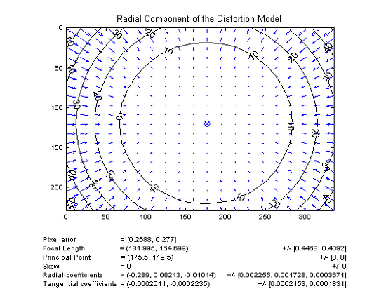
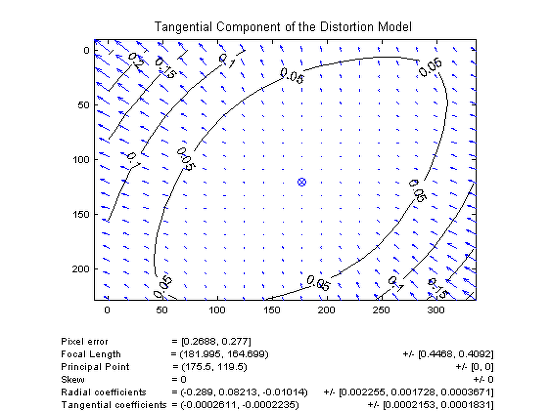
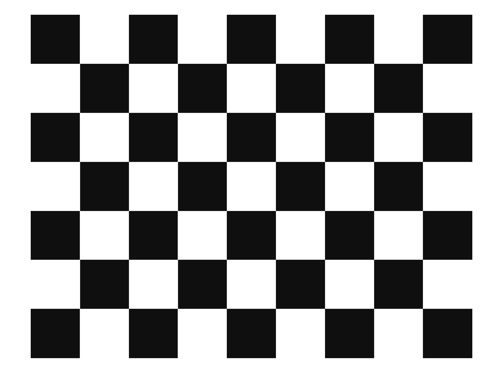
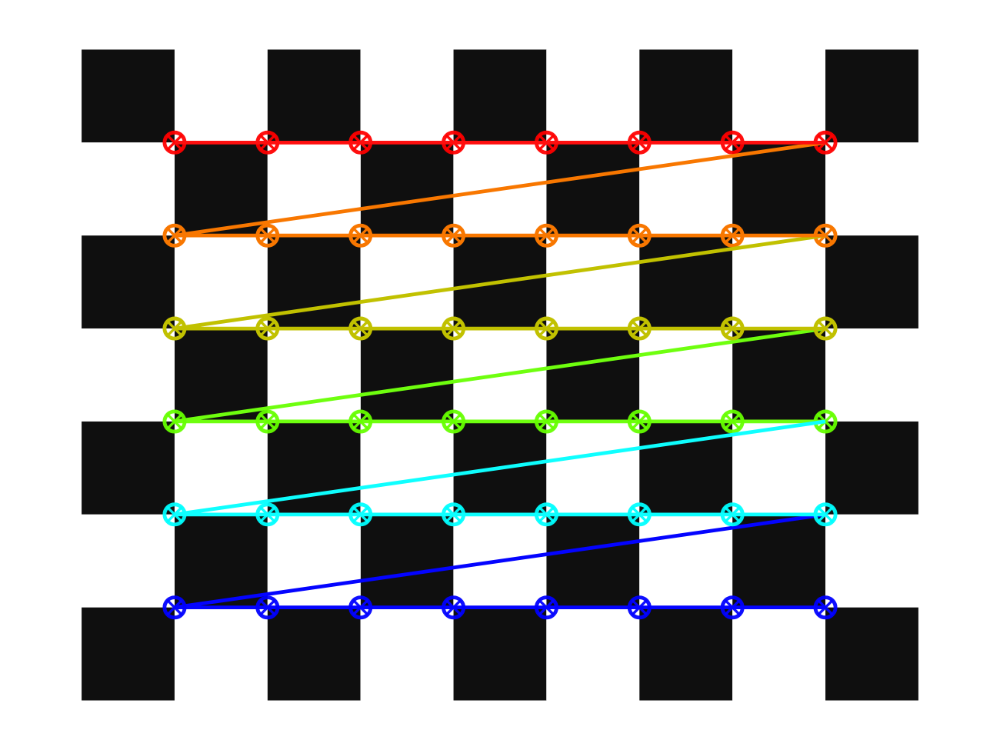

# Lecture 3: Camera Calibration

이 교육에서는 수집한 2D 이미지에서 카메라 렌즈에 의해 발생할 수 있는 왜곡을 보정하는 Camera Calibration 과정을 학습합니다.

---

## 1. 카메라에서 발생하는 왜곡의 종류

각각의 카메라에 의존적인 Intrinsic parameter가 존재합니다. 이는 **초점 거리** $f_x, f_y$, **광학 중심** $c_x, c_y$ 값을 의미합니다. 위 계수들은 다음과 같은 camera matrix로 표현되며, 이를 이용하여 특정 카메라의 렌즈에 의한 오차를 제거할 수 있습니다.

$$
camera \; matrix = \left [ \begin{matrix}   f_x & 0 & c_x \\  0 & f_y & c_y \\   0 & 0 & 1 \end{matrix} \right ]
$$

또한 카메라 렌즈에 의해, 다음 두가지 종류의 왜곡이 발생합니다.

- **Radial distortion (방사왜곡)**: 
  - 볼록렌즈의 굴절에 의해 발생하며, 영상 중심으로 부터의 거리에 의해 왜곡의 정도가 결정됩니다.
  - 이때, 영상 중심으로 부터의 거리 $r$에 대하여, 왜곡의 정도는 다음과 식으로 모델링됩니다. 
    $$
    x_{\text{distorted}} = x \left( 1 + k_1 r^2 + k_2 r^4 + k_3 r^6 \right) \\
    y_{\text{distorted}} = y \left( 1 + k_1 r^2 + k_2 r^4 + k_3 r^6 \right)
    $$

    <center></center>
- **Tangentional diostortion (접선왜곡)**:
  - 카메라 렌즈와 이미지 센서(CCD, CMOS)의 수평이 맞지 않아 발생하는 왜곡이며, 중심으로부터 타원 형태의 왜곡을 발생시킵니다.
  - 왜곡의 정도는 다음과 식으로 모델링됩니다. 
    $$
    x_{distorted} = x + [ 2p_1xy + p_2(r^2+2x^2)] \\
    y_{distorted} = y + [ p_1(r^2+ 2y^2)+ 2p_2xy]
    $$
    <center></center>

왜곡의 모델링에서 사용되는 계수 $k_1, k_2, p_1, p_2, k_3$ 구할 수 있다면 각 좌표에서 발생하는 방사왜곡과 접선왜곡의 정도를 구할 수 있습니다. 이를 이용하여 왜곡을 제거한 image를 구하면 Camera Calibration을 수행할 수 있을 것 입니다.

---

## 2. 체커보드를 이용한 3D 좌표 측정

Camera Calibration을 수행하기 위해서는 보정하고자 하는 이미지 내에 3차원 좌표를 정확히 알 수 있는 기준점이 존재해야 합니다. 따라서, 다음과 같은 체커보드를 이용하여 기준점을 설정하고자 합니다.
<center></center>

체커보드의 각 칸 간격의 정확한 규격을 알고 있으므로, 이미지 상에서 나타나는 꼭짓점들을 xy평면 상의 기준점으로 설정할 수 있습니다.
<center></center>


### 예제 코드 (`1_realsense.py`)

#### 주요 함수 및 역할

- `rs.pipeline()` / `cfg.enable_stream(...)`: 카메라 스트림 구성 및 시작  
- `wait_for_frames()`: 프레임 수신  
- `get_color_frame()`, `get_depth_frame()`: RGB / Depth 프레임 추출  
- `cv2.imshow(...)`: OpenCV 창에 영상 출력  
- `cv2.convertScaleAbs(...)` + `applyColorMap(...)`: Depth 데이터를 컬러맵으로 변환  
- `cv2.getWindowProperty(...)`: 창이 닫혔는지 감지하여 루프 종료  

---

### ▶ 실행 결과

- 실시간 컬러 영상과 컬러맵 처리된 깊이 영상이 두 개의 창으로 표시됨  
- 거리에 따라 색상이 달라지는 Depth Map을 통해 공간감 체험 가능


## 3. Intrinsics 파라미터 확인 및 중심 픽셀 3D 위치 추출 (`intrinsics_param.py`)

카메라 내부 파라미터 (`fx`, `fy`, `cx`, `cy`)를 확인하고 중심 픽셀의 3D 좌표를 추출합니다.

---

### ▶ 주요 함수 및 역할

- `profile.as_video_stream_profile().intrinsics`: 카메라 Intrinsics 객체 추출  
- `get_distance(x, y)`: 특정 픽셀의 거리값(m 단위) 추출  
- `rs.rs2_deproject_pixel_to_point(...)`: 2D 픽셀을 3D 월드 좌표로 변환  

---

### ▶ 출력 예시

```
Depth Camera Intrinsics:
  fx: 615.12, fy: 615.23
  cx: 320.00, cy: 240.00
  width: 640, height: 480

Pixel (320, 240)
 → Depth (Z): 0.833 m
 → 3D Position [X, Y, Z] (m): [0.0, 0.0, 0.833]
```


## 4. 마우스 클릭으로 픽셀 → 3D 좌표 변환 실습 (`click_to_3d.py`)

RGB 화면에서 사용자가 클릭한 픽셀의 3D 위치를 실시간으로 확인합니다.

---

### ▶ 주요 함수 및 역할

- `cv2.setMouseCallback(...)`: 마우스 클릭 이벤트 연결  
- `align = rs.align(rs.stream.color)`: RGB와 Depth 프레임 정렬  
- `get_distance(x, y)`: 클릭한 위치의 거리값 추출  
- `rs.rs2_deproject_pixel_to_point(...)`: 2D 픽셀을 3D 좌표로 변환  

---

### ▶ 실행 결과

- RGB 창에서 아무 위치나 클릭하면 해당 좌표의 깊이 및 3D 위치가 콘솔에 출력됨

```
Clicked Pixel: (312, 254)
 → Depth (Z): 0.782 m
 → 3D Position [X, Y, Z] (m): [0.017, -0.005, 0.782]
```


## 5. 자세 인식과 6DoF 개념 확장 (선택)

**6DoF**는 3차원 공간에서의 물체 자세(Pose)를 의미하며,  
3개의 위치 정보 (X, Y, Z)와 3개의 회전 정보 (Roll, Pitch, Yaw)를 포함합니다.  
이 개념은 로봇, 드론, 증강현실, 객체 추적 등 다양한 공간 기반 애플리케이션에서 핵심적으로 사용됩니다.

---

### 6자유도 (6 Degrees of Freedom, 6DoF)

3차원 공간에서 물체가 자유롭게 움직일 수 있는 여섯 가지 방향을 의미합니다.  
위치 이동 3가지와 회전 3가지를 포함하며, 다음과 같이 분류됩니다:

#### 위치 이동:
- **X축**: 좌우 이동  
- **Y축**: 상하 이동  
- **Z축**: 앞뒤 이동  

#### 회전 (Rotation):
- **Roll**: 앞을 기준으로 좌우로 기울기 *(비행기 날개처럼)*  
- **Pitch**: 옆을 기준으로 위아래 방향 회전  
- **Yaw**: 위에서 보는 방향 회전 *(방향 전환)*

(사진)

---

### 자세 추정 (Pose Estimation)

이러한 6DoF 정보를 추정하는 기술을 **자세 추정(Pose Estimation)**이라 하며,  
이 실습에서는 간단한 개념 소개와 대표 기술만 가볍게 다룹니다.  
자세 추정은 **RGB-D 카메라와 IMU**가 함께 사용될 때 더 정밀한 정보 획득이 가능합니다.

(사진)


## 마무리

이 실습을 통해 **RGB-D 카메라가 수집하는 데이터의 구조와 처리 방법**,  
그리고 **2D 이미지로부터 3D 공간 정보를 얻는 과정**을 이해할 수 있습니다.

추후에는 이 개념을 기반으로 다음과 같은 응용 분야로 확장할 수 있습니다:

- 로봇 비전 (Robot Vision)  
- SLAM (Simultaneous Localization and Mapping)  
- 3D Reconstruction (3차원 재구성)
