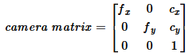
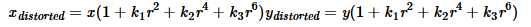
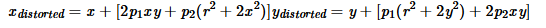

# Lecture 3: Camera Calibration

이 교육에서는 수집한 2D 이미지에서 카메라 렌즈에 의해 발생할 수 있는 왜곡을 보정하는 Camera Calibration 과정을 학습합니다.

## 목차
- [Lecture 3: Camera Calibration](#lecture-3-camera-calibration)
  - [목차](#목차)
  - [1. 카메라에서 발생하는 왜곡의 종류](#1-카메라에서-발생하는-왜곡의-종류)
  - [2. 체커보드를 이용한 Intrinsic Parameter 추출](#2-체커보드를-이용한-intrinsic-parameter-추출)
  - [3. Intrinsics Parameter를 이용한 보정 이미지 추출](#3-intrinsics-parameter를-이용한-보정-이미지-추출)
  - [3. 마무리](#3-마무리)

## 1. 카메라에서 발생하는 왜곡의 종류

카메라는 고유의 Intrinsic parameter가 존재합니다. 이는 **초점 거리** $f_x, f_y$, **광학 중심** $c_x, c_y$ 값을 의미합니다. 위 계수들은 다음과 같은 camera matrix로 표현됩니다.

또한 카메라 렌즈에 의해, 다음 두가지 종류의 왜곡이 발생합니다.

- **Radial distortion (방사왜곡)**: 
  - 볼록렌즈의 굴절에 의해 발생하며, 영상 중심으로 부터의 거리에 의해 왜곡의 정도가 결정됩니다.
  - 이때, 영상 중심으로 부터의 거리 $r$에 대하여, 왜곡의 정도는 다음과 식으로 모델링됩니다. 

- **Tangentional diostortion (접선왜곡)**:
  - 카메라 렌즈와 이미지 센서(CCD, CMOS)의 수평이 맞지 않아 발생하는 왜곡이며, 중심으로부터 타원 형태의 왜곡을 발생시킵니다.
  - 왜곡의 정도는 다음과 식으로 모델링됩니다. 

왜곡의 모델링에서 사용되는 계수 $k_1, k_2, p_1, p_2, k_3$ 구할 수 있다면 각 좌표에서 발생하는 방사왜곡과 접선왜곡의 정도를 구할 수 있습니다. 이를 이용하여 왜곡을 제거한 image를 구하면 Camera Calibration을 수행할 수 있을 것 입니다.

---

## 2. 체커보드를 이용한 Intrinsic Parameter 추출

Camera Calibration을 수행하기 위해서는 보정하고자 하는 이미지 내에 3차원 좌표를 정확히 알 수 있는 기준점이 존재해야 합니다. 따라서, 다음과 같은 체커보드를 이용하여 기준점을 설정하고자 합니다.

체커보드의 각 칸 간격의 정확한 규격을 알고 있으므로, 이미지 상에서 나타나는 꼭짓점들을 xy평면 상의 기준점으로 설정할 수 있습니다. 위 점들을 이용하여 카메라의 Intrinsic Parameter를 구해낼 수 있습니다.

#### 예제 코드 (`1_get_intrinsic_param.py`):

#### 주요 함수 및 역할

- `cv2.findChessboardCorners()`: 주어진 이미지에서 체커보드 격자판의 꼭짓점을 감지합니다.
- `cv2.drawChessboardCorners()`: 이미지에 감지된 체커보드를 표시합니다.  
- `cv2.calibrateCamera()`: 체커보드를 이용하여 구한 3차원 좌표와 2차원 픽셀 좌표를 매칭시켜 intrinsic parameter들을 계산합니다.

#### 실행 결과

- `camera_params\calibration_data` 폴더에 들어있는 사진들에 체커보드가 인식된 결과를 차례대로 표시
- 구한 3차원 좌표와 2차원 좌표를 매핑하여 Intrinsic Parameter 출력
- Intrinsic Parameter를 `camera_params\camera_intrinsic.json`에 저장

## 3. Intrinsics Parameter를 이용한 보정 이미지 추출

#### 예제 코드 (`2_calibrate.py`):

#### 주요 함수 및 역할

- `cv2.undistort()`: 카메라의 Intrinsic parameter를 이용해 이미지를 보정합니다.

#### 실행 결과

- `camera_params\undistorted` 폴더에 왜곡이 보정된 이미지들이 저장

    

    
    
    보정 전

    
    
    보정 후
    

## 3. 마무리

우리가 앞서 사용한 Realsense 3D 카메라는 내부적으로 distortion coefficient가 0으로 설정되어있기에, 이러한 보정 과정이 필요하지 않습니다. 그러나 일반적인 카메라를 사용할 경우, 위 과정은 필수적으로 수행되어야 합니다.
