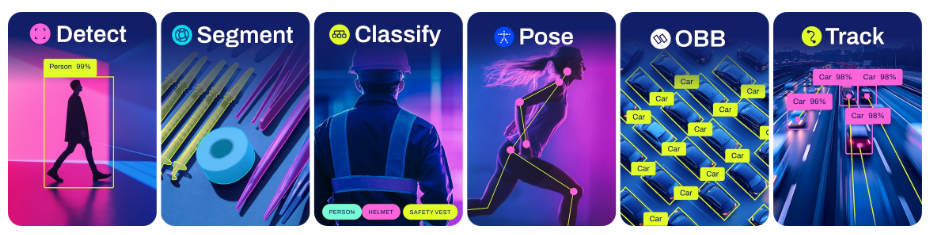

# Lecture 1: 비전 AI의 이해

이 강의에서는 비전 AI(Computer Vision + 인공지능)의 기본 개발, 주요 기술, 대표적인 모델과 활용 사례에 대해 학습합니다. 또한 이미지 데이터를 어떻게 처리하고, 이를 기반으로 학습/추론을 수행하는지 실습을 통해 경험해보고자 합니다.

---

## 1. 비전 AI라는 것은?

**비전 AI**는 카메라나 이미지 센서로부터 얻은 데이터를 기반으로 **사람처럼 시각적 판단을 수행하는 AI** 기술을 의미합니다. 인간의 시각 정보 처리 능력을 모방하여, 물체 인식, 거리 측정, 자세 추정, 행동 분석, 자율주행 등 다양한 분야에 활용됩니다.

비전 AI는 다음의 두 분야를 결합한 형태입니다:

- **컴퓨터 비전 (Computer Vision)**: 이미지에서 의미 있는 정보를 추출
- **딥러닝 (Deep Learning)**: CNN 기반의 학습을 통해 추상화된 의미 해석

---

## 2. 비전 AI 기술의 분류

| 기술 분류                      | 설명                                |
| -------------------------- | --------------------------------- |
| **분류(Classification)**     | 이미지 전체가 어느 클래스인지 판단               |
| **탑지(Detection)**          | 이미지 내에서 객체의 위치와 클래스 탑지 |
| **분할(Segmentation)**       | 각 피케일 단위로 클래스 분류      |
| **추적(Tracking)**           | 특정 객체를 시간적으로 추적                   |
| **자세 추정(Pose Estimation)** | 물체 또는 사람의 관절/위치 추정                |

<iframe width="560" height="315" src="https://www.youtube.com/embed/Avpce9ouYJQ?si=cQBtXFsOeHLXL1CM" title="YouTube video player" frameborder="0" allow="accelerometer; autoplay; clipboard-write; encrypted-media; gyroscope; picture-in-picture; web-share" referrerpolicy="strict-origin-when-cross-origin" allowfullscreen></iframe>

**Detection 모델 예시**

<iframe width="560" height="315" src="https://www.youtube.com/embed/D1LQPbYCc4o?si=eZSXq2-sNebzd9nW" title="YouTube video player" frameborder="0" allow="accelerometer; autoplay; clipboard-write; encrypted-media; gyroscope; picture-in-picture; web-share" referrerpolicy="strict-origin-when-cross-origin" allowfullscreen></iframe>

**Pose Estimation 모델 예시**

---

## 3. 비전 AI의 기본 구조

비전 AI는 보통 다음의 단계로 구성됩니다:

1. **데이터 수집**: 이미지, 영상, RGB-D 센서 등에서 데이터 수집
2. **전처리**: 크기 조정, 정규화, 증가 등
3. **모델 학습**: CNN 기반 모델(YOLO, ResNet 등)을 데이터에 맞공 학습
4. **추론**: 새로운 데이터에 대한 예측 수행
5. **후처리**: NMS(비최대 엄제), 좌표 변환 등
