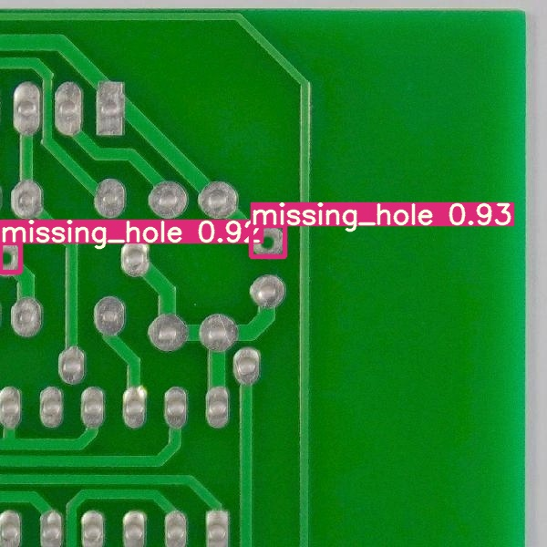

# Lecture 3: PCB 결함 탐지 실습

이 강의에서는 PCB(Printed Circuit Board) 이미지에서 결함을 탐지하기 위한 YOLO 모델의 활용 방법을 학습합니다. 실제 PCB 이미지를 사용하여 결함 탐지 모델을 학습하고 평가하는 과정을 진행합니다.
<center></center>

#### Reference
- https://www.kaggle.com/code/tatianakushniruk/pcb-defect-detection-with-yolov8/notebook

---

## 1. 데이터셋 구성

데이터셋 폴더는 다음과 같이 구성되어 있습니다.

```
datasets/
	PCB_dataset/
	- images/
		- trainPCB/
		- *.jpg
		- valPCB/
		- *.jpg
		- testPCB/
		- *.jpg
	- labels/
		- trainPCB/
		- *.txt
		- valPCB/
		- *.txt
		- testPCB/
		- *.txt	
```

해당 실습에서 사용할 데이터셋은 4가지 클래스(`freshapples`, `freshbanana`, `rottenbanana`, `rottenapples`)를 포함하고 있습니다.

<center>


</center>
