# Lecture 2: Pick and Place - 데이터 전처리 

## 1. Roboflow를 이용한 이미지 라벨링

Roboflow를 이용하면 데이터 전처리와 라벨링, 그리고 협업 작업을 간편하게 할 수 있습니다. 이를 활용하여 데이터 전처리를 실습해 보고자 합니다.

우선 `https://roboflow.com/`에 접속하여 줍니다.

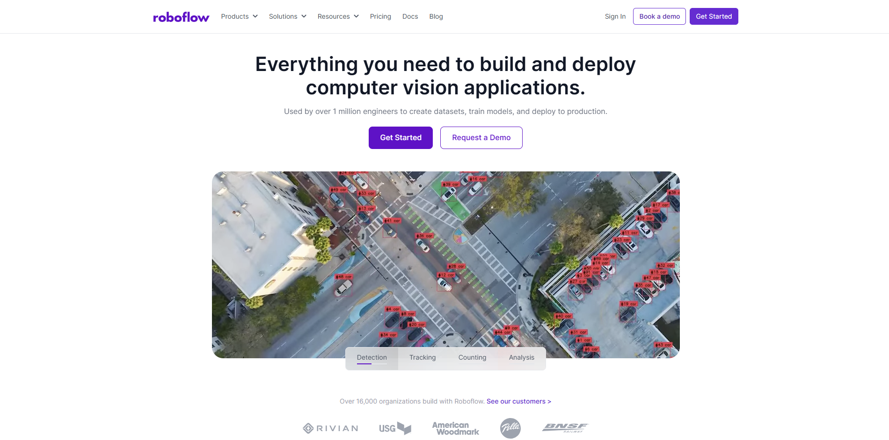

좌측 탭에서 Projects를 클릭한 후, New Project를 클릭합니다.

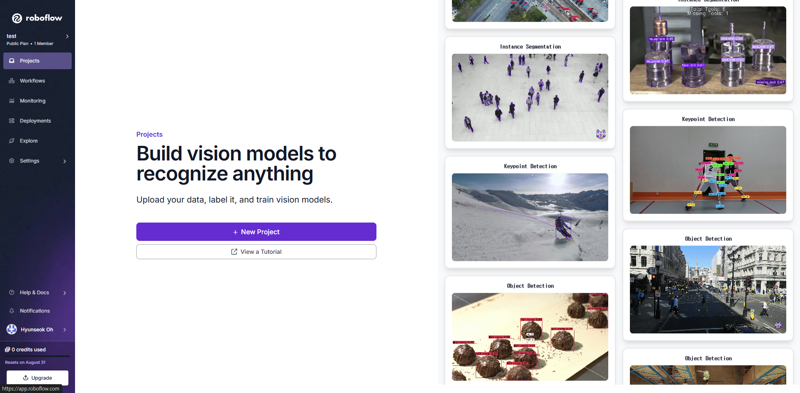

Object Detection을 선택하고, 프로젝트 이름 등을 입력한 뒤에 Create Public Project를 클릭합니다.

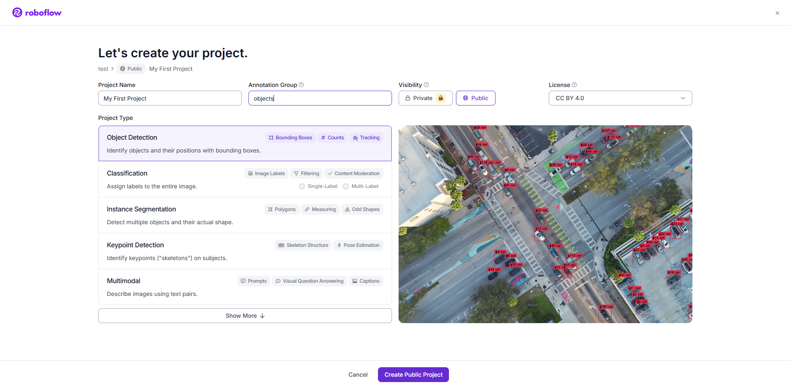

이후 위와 같은 창이 나오면, 이전 실습에서 수집한 데이터를 드래그하여 업로드 해 줍니다.

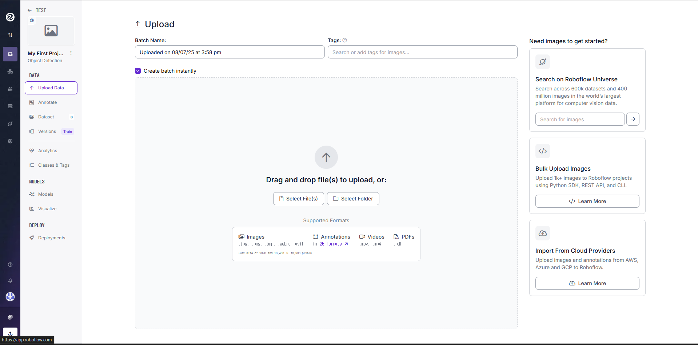

이중 이미지 하나를 클릭하여, 선택한 이미지에서부터 라벨링을 시작할 수 있습니다.

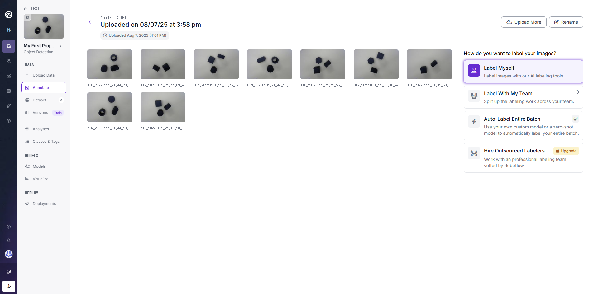

위와 같은 창에서, 우측에서 **Bounding Box Tool**을 선택한 후, 물체 하나에 사각형 테두리를 쳐줍니다. 

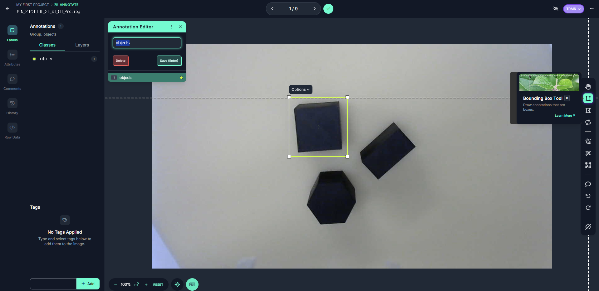

이후 사각형 테두리 안에 있는 물체의 이름을 지정한 뒤, 이를 이미지 내에 존재하는 모든 물체에 대해 반복합니다.

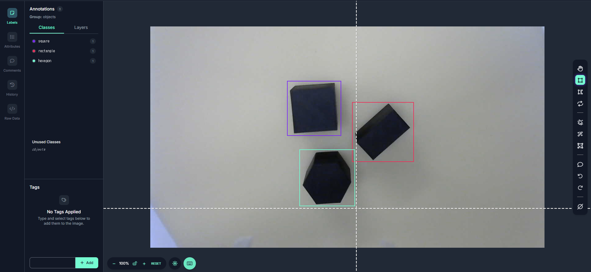

위와 같은 과정을 업로드한 모든 이미지에 대해 반복합니다. 업로드한 모든 이미지에 대해 라벨링을 완료한 뒤 Add image to Dataset을 클릭하면 데이터셋에 라벨링된 이미지가 포함됩니다. 이때, 데이터셋에서 Train, Valid, Test에 사용할 이미지 갯수의 비율을 나누어 저장할 수 있습니다.

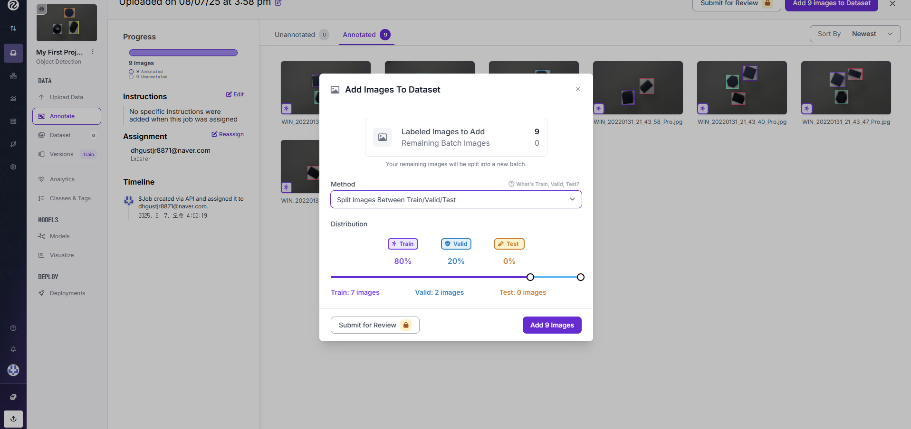

이후 좌측 탭에서 Datasets를 클릭하면, 라벨링한 이미지가 잘 데이터셋에 포함될 걸 확인할 수 있습니다. 또한 수동으로 각 이미지의 Split(Train, Valid, Test)을 조정하거나, 데이터셋에서 제외할 수 있습니다.

## 2. 데이터셋 생성

Create New Version을 클릭하여, 최종적인 데이터셋을 추출할 수 있습니다. 이후 다음과 같이 적용한 Preprocessing(데이터 전처리)을 선택할 수 있습니다. (기본 적용된 Auto Orient만 적용해도 무방합니다.)

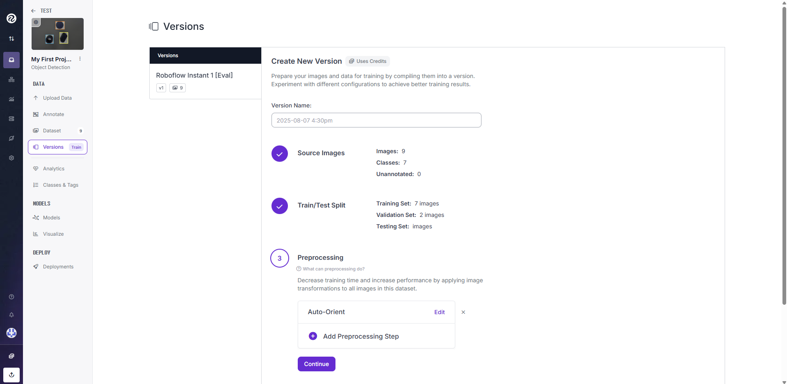

또한, **Augmentation**(데이터 증강)을 선택할 수 있습니다. 데이터 증강은 데이터셋의 다양성을 높이기 위해 이미지에 회전, 크기 조정, 색상 변화 등을 적용하는 기법입니다. 이 옵션을 선택하면, 데이터셋의 크기가 증가하고 모델의 일반화 능력이 향상될 수 있습니다. 

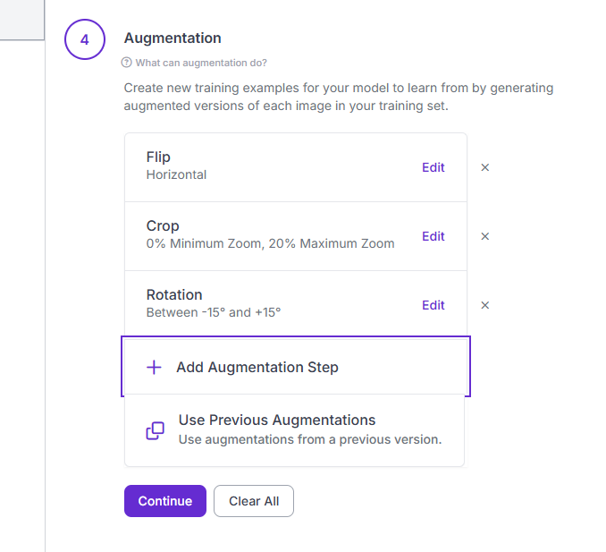

Continue를 누르고, Create Dataset을 클릭하면, 데이터셋이 생성됩니다. 이후 Download Dataset을 클릭하고, YOLOv11 포맷을 선택, Download zip to computer를 선택한뒤 다운로드 하면 로컬 컴퓨터에 zip 파일로 생성한 데이터셋이 다운로드됩니다.

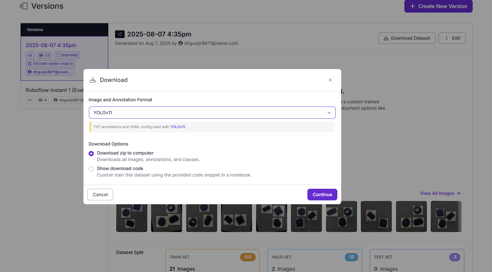

## 3. OBB를 위한 데이터셋 생성

## 유의점

성공적인 학습을 위해서는 최소한 100장 이상의 데이터가 필요합니다. 또한, 이미지 데이터는 다양한 상황에 대해서 주어질 수록 