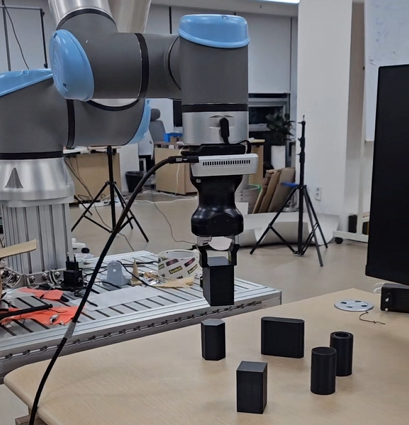

# Lecture 4: Pick and Place

## 1. Grpper 작동 확인

우선 Gripper를 사용하기 위해선, UR로봇을 로컬로 제어하여 Gripper를 Activate하여야 합니다.


`1_gripper_example.py` 파일을 실행하면, `scripts/gripper_example.script` 스크립트가 로봇에 전송됩니다. Gripper가 열고 닫히는걸 반복하는 것을 확인할 수 있습니다.

## 2. 물체 Detect 후 중앙 이동

`2_pose_init.py`를 실행시켜 로봇을 초기 위치로 이동시킵니다.

이후, `3_move_to_obj_center.py`를 실행시킵니다. 실행시, 그리퍼에 부착되어있는 3D 카메라로 현재 판 위에 존재하는 물체를 캡쳐합니다. 이후, 사전 학습된 YOLO Detection 불러오고, 캡쳐한 이미지 내에 존재하는 물체를 탐지합니다.

```python
# YOLO 탐지
results = model(source=color_image, verbose=False)
print("YOLO 탐지 완료")
results[0].show()
boxes = results[0].boxes
box_dict = {}
for box in boxes:
	cls_id = int(box.cls[0])
	print(box)
	if cls_id in box_dict:
		if box_dict[cls_id].conf < box.conf:
			box_dict[cls_id] = box
	else:
		box_dict[cls_id] = box
```
코드의 해당 부분은 YOLO 모델을 사용한 결과를 처리하는 부분입니다. model 함수의 리턴값은 YOLO 탐지결과를 포함하는 객체로 주어집니다. 해당 객체에는 `boxes` 속성이 포함되어있으며, 감지한 물체들의 바운딩 박스에 대한 정보를 담고 있습니다. 각 박스에 대한 정보는 ID(`cls`), 신뢰도(`conf`), 바운딩 박스 좌표(`xyxy`) 등이 있으며, 이를 활용하여 동일한 물체가 여러번 판별되었을 경우 가장 신뢰도가 높은 물체를 저장합니다.

```Python
box = box_dict[cls_id]
x1, y1, x2, y2 = map(int, box.xyxy[0])
cx = (x1+x2)//2
cy = (y1+y2)//2
print((x1, y1), (x2, y2))

# 3D 위치 계산
intrinsics = depth_frame.profile.as_video_stream_profile().intrinsics
pos_3d = get_3d_position(cx, cy, depth_frame, intrinsics)
```

터미널에 집고자 하는 물체를 입력하면, 그 물체의 바운딩 박스정보를 가져옵니다. 그리고 바운딩 박스의 2차원 픽셀상 중심을 구한뒤, 3D 카메라의 깊이 정보를 이용하여 3차원 좌표로 변환합니다. 해당 좌표로 물체에게 이동 명령을 내려, 그리퍼가 물체의 중앙 부근으로 이동합니다.

## 3. OBB 모델로 그리퍼와 물체 정렬 및 집기

`4_pickup_obb.py`를 실행시킵니다. 실행시, 그리퍼에 부착되어있는 3D 카메라로 현재 판 위에 존재하는 물체를 캡쳐합니다. 이후, 사전 학습된 YOLO Detection 불러오고, 캡쳐한 이미지 내에 존재하는 물체를 탐지합니다.

```Python
box = box_dict[cls_id]
print(box['xywhr'])
if box['xywhr'][2] < box['xywhr'][3]:
	angle = box['xywhr'][4]
else:
	angle = box['xywhr'][4] - np.pi/2

cx=box['xyxy'][0] + box['xyxy'][2]
cy=box['xyxy'][1] + box['xyxy'][3]
cx = int(cx/2)
cy = int(cy/2)

# 3D 위치 계산
intrinsics = depth_frame.profile.as_video_stream_profile().intrinsics
pos_3d = get_3d_position(cx, cy, depth_frame, intrinsics)
```

obb 모델의 결과값은 Detection 모델과 유사하나, 추가적으로 `xywhr` 속성이 포함되어 있으며, 이는 바운딩 박스의 회전각 `r`을 포함합니다. 해당 각도를 이용하여 UR 로봇의 손목에 `r`만큼 회전하도록 명령을 내림으로서 물체와 그리퍼를 정렬시킬 수 있습니다.

파이썬 파일은 UR 로봇에 스크립트와 물체 위치 정보를 전송합니다. 이때, 스크립트 상에서 지정된 좌표로 로봇이 이동하고, 그리퍼를 작동해 물체를 집은 뒤, 지정된 목표 지점에서 그리퍼를 열어 물체를 놓습니다.

